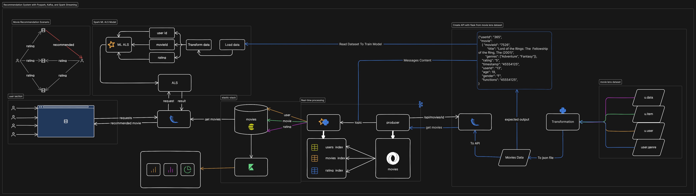

#### ```System Architecture```



#### ```Flask API```
> run a Flask API :
```
cd api

# Debugging is only for development mode.

flask --app main run --debug
```
> by default the id = 1

base url : "http://127.0.0.1:5000/api/movie"

> Get the movie by a specific ID.

url : "http://localhost:5000/api/movie?id=10"
<hr />

```
|=========================> The expected output:
{
  "age": 60,
  "function": "retired",
  "gender": "M",
  "genre": [
    "Comedy",
    "Drama"
  ],
  "movieId": 45,
  "name": "Eat Drink Man Woman (1994)",
  "number": "95076",
  "rating": 4,
  "release_date": "01-Jan-1994",
  "timestamp": 887736843000,
  "url": "http://us.imdb.com/M/title-exact?Yinshi%20Nan%20Nu%20(1994)",
  "userId": 308
}
```
<hr />

#### ```Producer:```


#### ```Consumer:```
